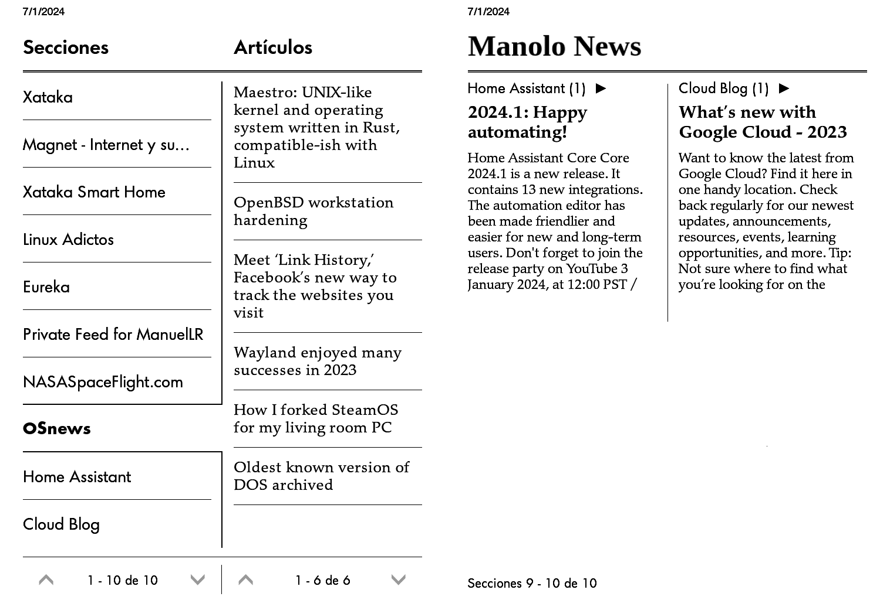
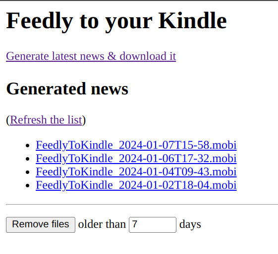

# FeedlyToKindle

> ⚠️ Keep in mind that this is a work in progress. Could be unstable and not work as expected.

This repository try to help you in the task of read your Feedly subscriptions in your e-reader.

> 

To achieve this, I implemented 2 utilities:
- A [Calibre](https://calibre-ebook.com/) recipe that download the articles from your Feedly subscriptions. This could be imported in your Calibre installation and use to download the articles easily to any reader.
- A basic http server that could be use directly from the browser of your e-reader. That server allow you to on-demand download the articles (using the [ebook-convert](https://manual.calibre-ebook.com/generated/en/ebook-convert.html) utility) without the necessity of connect your e-reader to calibre to transfer the feed.

This utilities could be used together or separately.


## Calibre recipe

The Calibre recipe is all you need to download the articles from your Feedly subscriptions. You can import it in your Calibre installation and use it to download the articles easily to any reader.

### How to use
1. Open Calibre
2. In the `Fetch news` sections, select `Add or modify a new source personalized`.
3. Select `New recipe`.
4. Select `Change to advanced mode`.
5. Copy the content of the [recipe](./FeedlyToCalibre.recipe) file in the text area.
6. Configure the required parameters (look for `os.getenv` calls).


## Basic http server

The basic http server is a tool to avoid to connect your e-reader to the compute. From the browser of your e-reader you can on-demand generate & download the news (using the [ebook-convert](https://manual.calibre-ebook.com/generated/en/ebook-convert.html) utility from Calibre under the hood).

As you can customize the command executed to generate the ebook, you can use this tool to generate anything from any source.

### How to use
```bash
# Ensure that you had the .env file properly filled

# Steps to install & upgrade (remember to re-build the container after upgrade)
docker-compose build && docker-compose up -d
```

Now you only need to access to the server from your e-reader browser.

> 

## QA

### How to get the Feedly access token?
I haven't found a way to get the access token in an easy way or a persistent token.

So, to get the access token, I access to Feedly using the browser, open the advanced option > Network section, look for "api.feedly.com/v3/profile" and select the token passed to Feedly in the `Authorization` header (the value without "Bearer ").

### How to get the Feedly stream id?
In the Feedly web, open the feed you want to download and look for the `id` parameter in the url. For example, for the feed `https://feedly.com/i/collection/content/user/xyz-xyz-xyz/category/global.all` the id is `user/xyz-xyz-xyz/category/global.all`.

## Tested on
- Kindle Paperwhite 1th generation. Firmware 5.6.1
